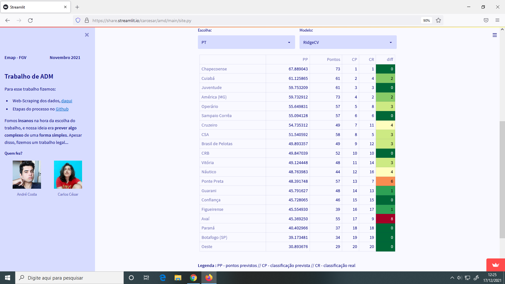
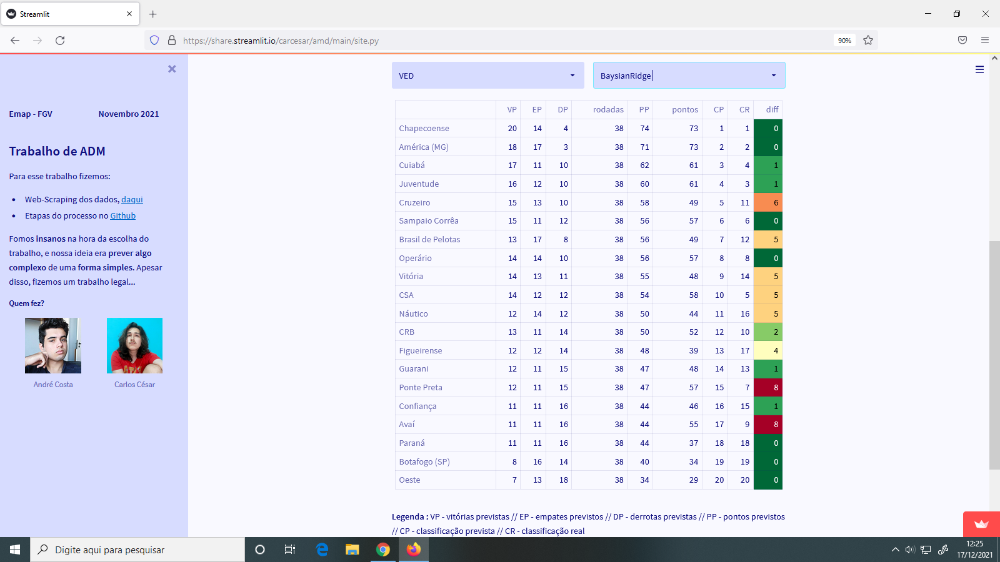
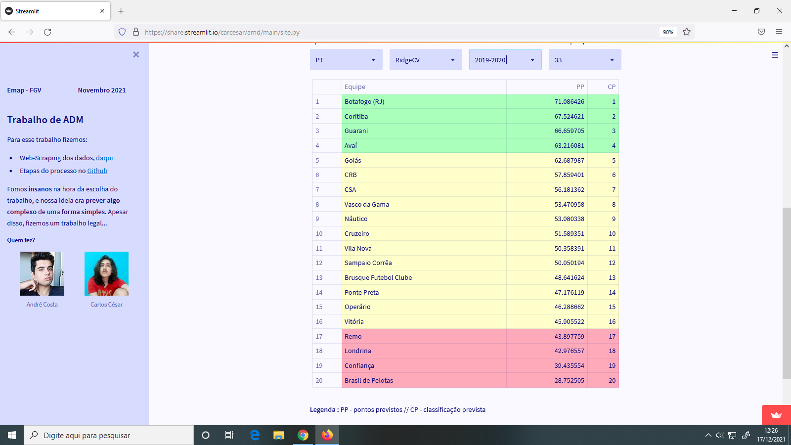
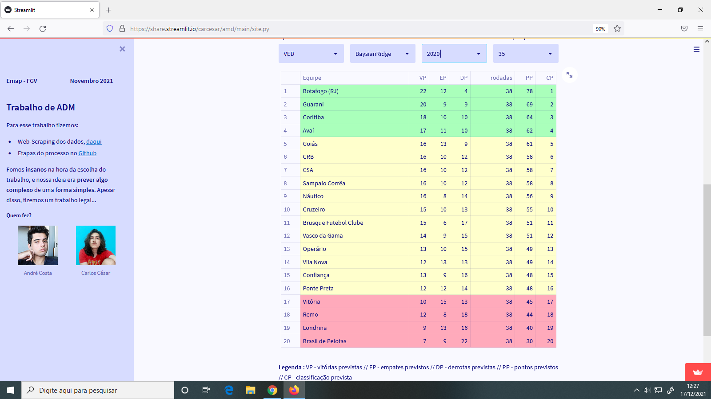

# AMD
Trabalho de Aquisição e Manipulação de Dados

---

### Mini indice:
* [Git Hub](https://github.com/CarCesar/AMD)
    * [Notebook](https://github.com/CarCesar/AMD/tree/main/Trabalho-Notebook)
        * [Dados](https://github.com/CarCesar/AMD/tree/main/Trabalho-Notebook/Dados)
        * [Codigo `WEB-SCRAPING`](https://github.com/CarCesar/AMD/blob/main/Trabalho-Notebook/Dados/Serie%20B%202020.ipynb)
    * [Streamlit](https://github.com/CarCesar/AMD/blob/main/site.py)
* [Aplicação](https://share.streamlit.io/carcesar/amd/main/site.py)

Pela limitação do recurso gratuito que temos para aplicação tivemos que tira-la do ar...
Para tanto, resolvemos documenta-la aqui.

